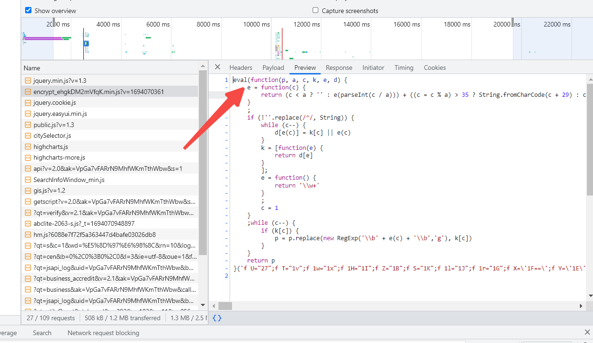
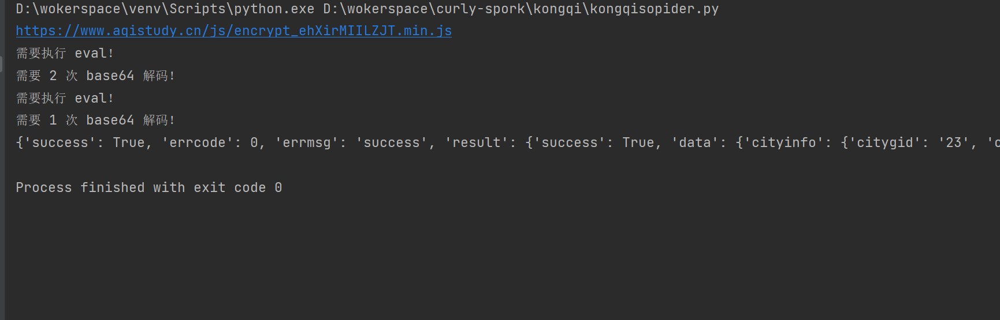

空气质量检测平台
一打开会进入无限debugger 直接hook掉，但是马上又会进入定时器debuggr，同样咱们也hook掉
```javascript
Function.prototype.constructor_ = Function.prototype.constructor;
Function.prototype.constructor = function (a) {
    if(a == "debugger") {
        return function (){};
    }
    return Function.prototype.constructor_(a);
};

// Hook setTimeout
var setTimeout_ = setTimeout
var setTimeout = function (func, time){
    if (func == txsdefwsw){
        return function () {};
    }
    return setTimeout_(func, time)
}

var setInterval_ = setInterval
setInterval = function (func, time){
    if (time == 2000) {
        return function () {};
    }
    return setInterval_(func, time)
}
```

这个站比较麻烦的是加密解密的 JS 是动态变化的，定义的密钥 key 和偏移量 iv 都是隔段时间就会改变的。
生成加密的 param 时，appId 是变化的，最后的加密分为 AES、DES 和没有加密，三种情况，并且最后发送请求时，data 键值对，其中的键也是变化的。
所以就要找JS的源头，是放在一个虚拟机里的。重新抓包找到一个encrypt_xxxxxx.js，就去就可以看到放在eval里的代码：

直接去掉eval在浏览器里执行一下就会发现是我们要找的代码，但是我们会发现encrypt_xxxxxx.js每次请求的时候名字都会变，
可以在主页面中找到encrypt_xxxxxx.js的名字，然后使用正则来拿取就行了。
但是encrypt_xxxxxx.js 返回的 JS，并不是所有的执行一遍 eval 就能得到明文代码了，它是 eval 和 base64 相结合的，第一遍都是 eval，
但是后面就说不定了，有可能直接出结果，有可能需要 base64，有可能 base64 两遍，有可能两遍 base64 之后还要再 eval，总之，除了第一遍是 eval 以外，
后面是否需要 base64 和 eval，以及需要的次数和先后顺序，都是不确定的
那么针对 encrypt_xxxxxx.js 内容不确定的情况，我们可以写一个方法，获取到 encrypt_xxxxxx.js 后，需要执行 eval 就执行 eval，需要执行 base64 
就执行 base64，直到没有 eval 和 base64 即可，可以分别用字符串 eval(function 和 dswejwehxt( 来判断是否需要 eval 和 base64（当然也有其他方式，比如 () 的个数等），
示例代码如下所示：
```python
def get_decrypted_js(encrypted_js_url):
    """
    :param encrypted_js_url: encrypt_xxxxxx.js 的地址
    :return: 解密后的 JS
    """
    decrypted_js = requests.get(url=encrypted_js_url, headers=headers).text
    flag = True
    while flag:
        if "eval(function" in decrypted_js:
            # 需要执行 eval
            print("需要执行 eval！")
            replace_js = decrypted_js.replace("eval(function", "(function")
            decrypted_js = execjs.eval(replace_js)
        elif "dswejwehxt(" in decrypted_js:
            # 需要 base64 解码
            base64_num = decrypted_js.count("dswejwehxt(")
            print("需要 %s 次 base64 解码！" % base64_num)
            decrypted_js = re.findall(r"\('(.*?)'\)", decrypted_js)[0]
            num = 0
            while base64_num > num:
                decrypted_js = base64.b64decode(decrypted_js).decode()
                num += 1
        else:
            # 得到明文
            flag = False
    return decrypted_js
```

拿到动态JS之后，将CryptoJS、Base64、hex_md5补齐，这里我们自己写一个JS，
然后把里面的 key、iv、appId、data 键名、param 是否需要 AES 或 DES 加密，
这些信息都匹配出来，然后传给我们自己写的 JS，调用我们自己的方法拿到加密结果。
```javascript
var CryptoJS = require("crypto-js");

var BASE64 = {
    encrypt: function (text) {
        return CryptoJS.enc.Base64.stringify(CryptoJS.enc.Utf8.parse(text))
    },
    decrypt: function (text) {
        return CryptoJS.enc.Base64.parse(text).toString(CryptoJS.enc.Utf8)
    }
};

var DES = {
    encrypt: function (text, key, iv) {
        var secretkey = (CryptoJS.MD5(key).toString()).substr(0, 16);
        var secretiv = (CryptoJS.MD5(iv).toString()).substr(24, 8);
        secretkey = CryptoJS.enc.Utf8.parse(secretkey);
        secretiv = CryptoJS.enc.Utf8.parse(secretiv);
        var result = CryptoJS.DES.encrypt(text, secretkey, {
            iv: secretiv,
            mode: CryptoJS.mode.CBC,
            padding: CryptoJS.pad.Pkcs7
        });
        return result.toString();
    },
    decrypt: function (text, key, iv) {
        var secretkey = (CryptoJS.MD5(key).toString()).substr(0, 16);
        var secretiv = (CryptoJS.MD5(iv).toString()).substr(24, 8);
        secretkey = CryptoJS.enc.Utf8.parse(secretkey);
        secretiv = CryptoJS.enc.Utf8.parse(secretiv);
        var result = CryptoJS.DES.decrypt(text, secretkey, {
            iv: secretiv,
            mode: CryptoJS.mode.CBC,
            padding: CryptoJS.pad.Pkcs7
        });
        return result.toString(CryptoJS.enc.Utf8);
    }
};

var AES = {
    encrypt: function (text, key, iv) {
        var secretkey = (CryptoJS.MD5(key).toString()).substr(16, 16);
        var secretiv = (CryptoJS.MD5(iv).toString()).substr(0, 16);
        secretkey = CryptoJS.enc.Utf8.parse(secretkey);
        secretiv = CryptoJS.enc.Utf8.parse(secretiv);
        var result = CryptoJS.AES.encrypt(text, secretkey, {
            iv: secretiv,
            mode: CryptoJS.mode.CBC,
            padding: CryptoJS.pad.Pkcs7
        });
        return result.toString();
    },
    decrypt: function (text, key, iv) {
        var secretkey = (CryptoJS.MD5(key).toString()).substr(16, 16);
        var secretiv = (CryptoJS.MD5(iv).toString()).substr(0, 16);
        secretkey = CryptoJS.enc.Utf8.parse(secretkey);
        secretiv = CryptoJS.enc.Utf8.parse(secretiv);
        var result = CryptoJS.AES.decrypt(text, secretkey, {
            iv: secretiv,
            mode: CryptoJS.mode.CBC,
            padding: CryptoJS.pad.Pkcs7
        });
        return result.toString(CryptoJS.enc.Utf8);
    }
};

function getDecryptedData(data, AES_KEY_1, AES_IV_1, DES_KEY_1, DES_IV_1) {
    data = AES.decrypt(data, AES_KEY_1, AES_IV_1);
    data = DES.decrypt(data, DES_KEY_1, DES_IV_1);
    data = BASE64.decrypt(data);
    return data;
}

function ObjectSort(obj) {
    var newObject = {};
    Object.keys(obj).sort().map(function (key) {
        newObject[key] = obj[key];
    });
    return newObject;
}

function getRequestParam(method, obj, appId) {
    var clienttype = 'WEB';
    var timestamp = new Date().getTime()
    var param = {
        appId: appId,
        method: method,
        timestamp: timestamp,
        clienttype: clienttype,
        object: obj,
        secret: CryptoJS.MD5(appId + method + timestamp + clienttype + JSON.stringify(ObjectSort(obj))).toString()
    };
    param = BASE64.encrypt(JSON.stringify(param));
    return param;
}

function getRequestAESParam(requestMethod, requestCity, appId, AES_KEY_2, AES_IV_2){
    var param = getRequestParam(requestMethod, requestCity, appId);
    return AES.encrypt(param, AES_KEY_2, AES_IV_2);
}

function getRequestDESParam(requestMethod, requestCity, appId, DES_KEY_2, DES_IV_2){
    var param = getRequestParam(requestMethod, requestCity, appId);
    return DES.encrypt(param, DES_KEY_2, DES_IV_2);
}
```
最后的结果：

